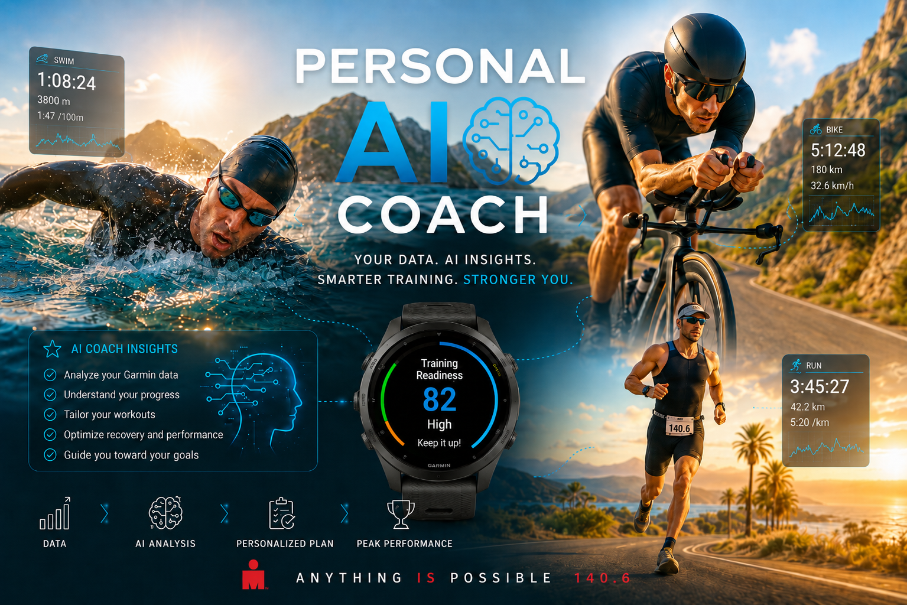
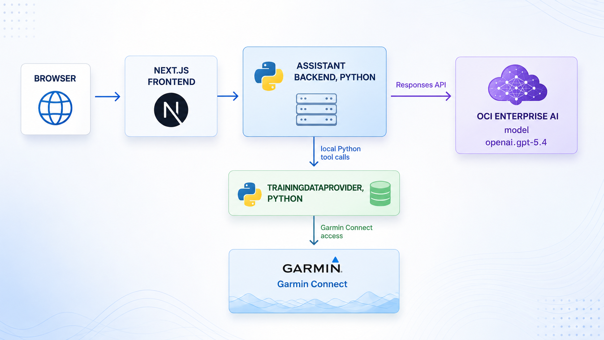

# Personal Training AI Coach

[](https://www.python.org/)
[](https://github.com/psf/black)
[](https://pylint.pycqa.org/)
[](LICENSE)



A personal assistant for turning training data, nutrition diary
notes, and nutrition-plan context into useful conversations, clear
explanations, and coaching-style insights.

The idea is simple: instead of looking at charts, numbers, isolated activities,
and scattered food notes, you can ask natural-language questions about your
training history and receive contextual answers. For example:

- How has my training load changed over the last four weeks?
- Which runs had an unusually high heart rate for the pace?
- Summarize my latest cycling workout.
- Did I increase volume too quickly this week?
- What should I pay attention to before my next long run?
- Did my food diary match the nutrition plan during this training week?
- Were there recurring nutrition gaps around harder workout days?

The project is designed to be local, controllable, and privacy-first. 
Training data and nutrition notes are personal data, so the architecture avoids
risky shortcuts and keeps data access, AI reasoning, and the web interface
clearly separated.

## Vision

Personal Training AI Coach aims to become a web assistant that can read training data
on demand, reason about training context, and return coaching-style answers: not
just metrics, but practical interpretation.

Sports preparation is not only about workouts. Nutrition, recovery, and daily
habits shape how training is absorbed. For this reason, the assistant also
includes an early nutrition diary workflow: the user can record daily meals,
upload a nutrition plan, and ask for adherence-oriented reflections that connect
food notes with the current plan and the observed training load.

The goal is not to replace a coach, a nutritionist, or qualified professional
advice. The nutrition features are intended as a reflection and preparation
support: they can help surface patterns, missing diary details, recurring gaps,
and useful questions to discuss with a nutrition professional.

The initial goal is to build a solid foundation for querying personal sports
and nutrition-support data naturally:

- understand trends in volume, intensity, and recovery
- compare weeks, activities, and training periods
- identify anomalies in workouts
- get quick summaries of recent sessions
- review food diary notes against the current nutrition plan
- connect nutrition adherence with training-day demands
- receive cautious, grounded guidance on signals worth monitoring

## Intended Architecture

This repository follows a spec-driven development approach. The reference specification is:

```text
docs/specs/personal_ai_garmin_assistant_spec.md
```

The current local architecture is composed of a browser-facing NGINX reverse
proxy, two application services, and a local Python data access layer:



### Frontend Next.js

The frontend provides the web experience: chat, loading states, errors, and response rendering. It does not access Garmin Connect directly and does not call the AI model directly.

### Assistant backend

The assistant backend receives user questions, decides which Garmin data is needed through model tool calling, calls the local Python training data provider, and builds requests to OCI Enterprise AI using the Responses API.

### Data access layer

The data access layer is the only code path that knows Garmin Connect implementation details. In the current implementation it runs inside the assistant backend process behind `TrainingDataProvider`. It handles authentication, data retrieval, PII redaction, Garmin-specific errors, rate limits, and future caching.


### Nutrition and adherence analysis

The frontend includes an early nutrition diary page for the nutrition adherence
extension. The page lets the authenticated user select a diary date, choose the
training context for the day, describe meals and notes in free text, and save or
update the selected day.

The same page includes a nutrition-plan upload widget. The user can upload one
PDF nutrition plan; uploading a new PDF replaces the previous current plan. The
assistant backend extracts text from the PDF and stores that text, plus basic
metadata, in the local MySQL database. The original PDF is not retained by the
current MVP.

The assistant backend persists diary entries and the current nutrition plan
through dedicated nutrition services. It also exposes an on-demand nutrition
adherence analysis tool that compares the authenticated user's diary entries,
current plan, and Garmin training context for the requested period. Docker
Compose runs MySQL Community Edition in a dedicated container and mounts its
data directory from the host filesystem so entries, plans, application users,
and Garmin credential metadata survive rebuilds, stop/start cycles, and
restarts.

### Local multi-user model

The current local deployment is multi-user through an NGINX Basic Auth reverse
proxy. NGINX forwards the authenticated username to the frontend and backend
using `X-Authenticated-User`; the backend resolves that username to a stable
local `user_id` before reading or writing user-owned data.

Garmin credentials are configured per authenticated application user from the
`/account` page and are stored encrypted in local MySQL. Garmin session tokens
are stored under a user-specific directory below
`GARMIN_SESSION_STORAGE_ROOT`. Nutrition diary entries and the current nutrition
plan are also scoped by `user_id`.

## Guiding Principles

- Training data is sensitive: no credentials in the repository, no raw data payloads in logs, and no full prompts containing private training details by default.
- Assistant orchestration never accesses Garmin Connect directly: it always goes through the dedicated local provider boundary.
- The first version does not introduce an MCP server.
- The deployment target is Docker Compose on Ubuntu Linux, intended to run locally on an Intel NUC.
- Python code must use Python 3.11 or newer, clear typing, small modules, and tests with `pytest`.
- Changes must stay small, verifiable, and consistent with the specification.

## Milestones

1. Done: Repository skeleton with Docker Compose, health endpoints, and a basic frontend page.
2. Done: Garmin data provider foundation with provider methods, PII redaction, session reuse, and mocked tests.
3. Done: Assistant backend foundation with chat endpoints, local training provider tools, date range inference, and OCI Enterprise AI Responses API integration.
4. Done: Frontend chat flow with streaming responses, loading states, error states, Markdown rendering, and token usage display.
5. Done: Local deployment hardening with Docker Compose, NGINX reverse proxy, environment variables, health checks, and operating documentation.
6. Implemented MVP: Nutrition diary, PDF plan upload, MySQL-backed per-user persistence, and on-demand adherence analysis through assistant tooling.
7. Implemented foundation: Local multi-user support with Basic Auth, application users, backend current-user resolution, user-scoped Garmin credentials, user-scoped Garmin session storage, and user-scoped nutrition data.

Remaining polish is tracked in the specification and migration notes: clearer
frontend handling of 401/403 responses, current-user display/logout guidance for
Basic Auth, broader HTTP-level cross-user tests, and eventual retirement of the
legacy single-user Garmin environment fallback from the default runtime path.

## Project Status

The project now has a first working vertical slice:

- A Next.js chatbot frontend with light and black themes, sidebar status indicators, quick prompts, streaming response handling, and Markdown rendering.
- A frontend navigation menu linking the coaching chat, food diary page, and account settings page.
- A nutrition diary UI with date selection, training type selection, meal descriptions, notes, local draft preview, save/update flows, and a PDF nutrition-plan upload widget.
- A FastAPI assistant backend exposing `/health`, `/chat`, `/chat/stream`, nutrition diary endpoints, and nutrition-plan upload/read endpoints.
- MySQL-backed, user-scoped nutrition diary and nutrition-plan persistence through dedicated backend services.
- On-demand nutrition adherence analysis that uses the current user's nutrition plan, diary entries, and Garmin training context.
- Responses API integration for OCI Enterprise AI using model `openai.gpt-5.5`.
- Model tool calling with `list_activities`, `get_heart_rates`, and `analyze_nutrition_adherence_period`, backed by local Python service boundaries.
- A Garmin Connect provider foundation with PII redaction and mocked tests.
- Local multi-user support with NGINX Basic Auth, a backend `users` table, per-user encrypted Garmin credentials, and per-user Garmin session storage.
- Backend logging for request flow, model calls, tool execution, and stream completion.
- Docker Compose and Dockerfiles for the current browser-facing `nginx` service plus internal `frontend`, `assistant_api`, and `mysql` services.

The current implementation is still an early local development version. It
requires local environment configuration for OCI inference and a
`GARMIN_CREDENTIAL_ENCRYPTION_KEY` before live end-to-end coaching questions can
use real Garmin data. Garmin credentials are configured per authenticated user
from the account page and are stored encrypted in local MySQL. The nutrition
MVP stores daily entries and one current extracted nutrition plan per user.

## Local Docker Runtime

Create a local `.env` from `.env.example`, fill in private values, then run:

```bash
docker compose up --build
```

Create the first local Basic Auth user before starting the browser-facing
stack:

```bash
docker compose build assistant_api
./scripts/create_basic_auth_user.sh alice "Alice Runner"
```

The script creates or updates one entry in `deployment/nginx/auth/.htpasswd`
and one matching row in the MySQL `users` table. The username maps to a stable
internal `user_id` used as the ownership key for Garmin credentials, Garmin
session storage, nutrition diary entries, and nutrition plans.

The `.htpasswd` file is bind-mounted into the NGINX container and must be
readable by the container's NGINX worker. If NGINX logs `Permission denied` for
`/etc/nginx/auth/.htpasswd`, fix the host file permissions and restart NGINX:

```bash
chmod 644 deployment/nginx/auth/.htpasswd
docker compose restart nginx
```

After login, open `/account` to save, test, replace, or delete the current
user's Garmin credentials. Garmin session tokens are stored in a user-specific
directory under `GARMIN_SESSION_STORAGE_ROOT`.

The application is exposed through nginx at `http://localhost:3000`. The
assistant backend is internal to Docker Compose and is reached by the frontend
through `http://assistant_api:8000`.

If the host port is already in use, override `FRONTEND_PORT` in `.env`.

Nutrition diary entries, extracted nutrition-plan text, local users, and
encrypted Garmin credential metadata are stored in MySQL. Docker Compose mounts
the MySQL data directory from `${MYSQL_DATA_DIR:-./data/mysql}` on the host to
`/var/lib/mysql` in the MySQL container. The database survives
`docker compose stop`, `docker compose restart`, `docker compose down`, and
assistant API rebuilds as long as that host directory is preserved.

To migrate an existing SQLite deployment, start MySQL and run:

```bash
docker compose up -d mysql
docker compose run --rm \
  --volume /absolute/host/path/garmin_ai_coach.db:/migration/garmin_ai_coach.db:ro \
  assistant_api \
  python -m services.assistant_api.persistence.migrate_sqlite_to_mysql \
    --sqlite-path /migration/garmin_ai_coach.db \
    --initial-username alice
```

If the old SQLite file already contains `users` and `user_id` columns, omit
`--initial-username`.

### Runtime Configuration

Keep private values in `.env` or mounted secret files. Do not commit Garmin
credentials, OCI API keys, generated Garmin session tokens, or local `.env`
files.

| Variable | Required | Used by | Description |
| --- | --- | --- | --- |
| `GARMIN_USERNAME` | Only for legacy local scripts | examples, fallback provider | Garmin Connect account username for the legacy single-user provider path. |
| `GARMIN_PASSWORD` | Only for legacy local scripts | examples, fallback provider | Garmin Connect account password for the legacy single-user provider path. |
| `GARMIN_SESSION_STORAGE_PATH` | Only for legacy local scripts | examples, fallback provider | Path where legacy single-user Garmin session tokens are reused and refreshed. |
| `GARMIN_CREDENTIAL_ENCRYPTION_KEY` | Yes for multi-user Garmin access | `assistant_api` | Fernet key used to encrypt per-user Garmin credentials in MySQL. |
| `GARMIN_SESSION_STORAGE_ROOT` | Recommended | `assistant_api` | Root directory for user-scoped Garmin session token storage. Docker defaults this to `/data/garmin-sessions`. |
| `REDACT_PII` | No | `assistant_api`, Garmin provider | Masks account, owner, location, coordinate, and profile fields before training data can move toward assistant context. Defaults to `true`. |
| `GARMIN_COMPACT_ACTIVITY_PAYLOAD` | No | `assistant_api`, Garmin provider | Keeps only coaching-relevant activity summary, zone, split, and training-effect fields before tool output is sent toward the model. Defaults to `false`. |
| `GENAI_API_KEY` | Yes for model calls | `assistant_api`, examples | OCI Enterprise AI OpenAI-compatible API key. |
| `REGION` | Yes for model calls | `assistant_api`, examples | OCI region used to build the OpenAI-compatible inference endpoint, for example `eu-frankfurt-1`. |
| `OCI_MODEL_ID` | No | `assistant_api`, examples | OCI hosted model identifier. Defaults to `openai.gpt-5.5`. |
| `MYSQL_HOST` | Yes | `assistant_api` | MySQL host. Docker Compose sets this to `mysql`. |
| `MYSQL_PORT` | Yes | `assistant_api` | MySQL port. Docker Compose defaults this to `3306`. |
| `MYSQL_DATABASE` | Yes | `mysql`, `assistant_api` | Application database name. Defaults to `garmin_ai_coach`. |
| `MYSQL_USER` | Yes | `mysql`, `assistant_api` | Application database username. |
| `MYSQL_PASSWORD` | Yes | `mysql`, `assistant_api` | Application database password. Keep this in `.env` or a secret file. |
| `MYSQL_ROOT_PASSWORD` | Yes | `mysql` | MySQL root password for the local container. Keep this in `.env` or a secret file. |
| `MYSQL_DATA_DIR` | Recommended | Docker Compose | Host filesystem path mounted to `/var/lib/mysql`. Defaults to `./data/mysql`. |
| `ASSISTANT_API_URL` | Yes for local frontend development | frontend route handlers | Backend URL used by the Next.js server when running outside Docker, usually `http://localhost:8000`. Docker Compose sets this internally to `http://assistant_api:8000`. |
| `NEXT_PUBLIC_ASSISTANT_API_URL` | No | frontend route handlers | Optional fallback backend URL for non-Docker frontend experiments. Docker Compose sets this internally to `http://assistant_api:8000`. |
| `FRONTEND_PORT` | No | Docker Compose | Host port mapped to nginx, which protects and proxies the frontend. Defaults to `3000`. |
| `LOG_LEVEL` | No | `assistant_api` | Python logging level. Defaults to `INFO`. |

## Quickstart

See `QUICKSTART.md` for local runtime and development environment setup.

Before changing application code, read:

```text
AGENTS.md
docs/specs/personal_ai_garmin_assistant_spec.md
```

## Garmin Disclaimer

Garmin is a registered trademark of Garmin Ltd. or its subsidiaries. This
project is an independent, open-source tool and is not affiliated with, endorsed
by, sponsored by, or approved by Garmin Ltd. All data is sourced from the user's
own Garmin Connect account.
